# MY LAMP STACK IMPLEMENTATION ON AWS
### Linux | Apache | MySQL | PHP

---

## 🏆 What I Gained From This Project

After completing this project, I:

- Became very confident working in the Linux terminal
- Deepened my understanding of web stacks and the differences between **LAMP, LEMP, MEAN, and MERN**
- Developed solid Linux administration skills in storage management, troubleshooting, and basic networking
- Gained hands-on AWS experience provisioning and configuring cloud infrastructure to host a website

---

## 📋 Project Overview

This document details the provisioning of a **LAMP stack** (Linux, Apache, MySQL, PHP) on an **AWS EC2** instance. The setup was executed as part of an environment configuration exercise. Screenshots below serve as deployment artifacts, presented in the exact order they were captured during stack initialization.

---

## Step 0 — Preparing Prerequisites

In order to complete this project, I needed an AWS account and a virtual server with Ubuntu Server OS.

- Registered and configured an AWS account

- Launched a new EC2 instance — **Ubuntu Server 26.04 LTS, t3.micro, Free Tier eligible**

## 📁 Launch Configuration Reference

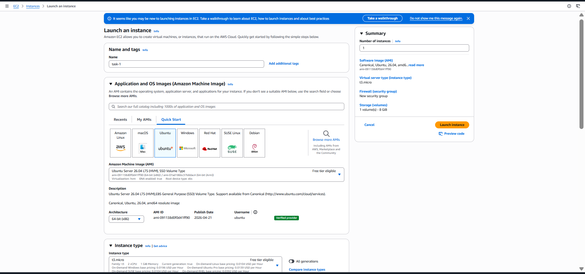

- **AMI:** Ubuntu Server 26.04 LTS (HVM), SSD Volume Type
- **Instance Type:** t3.micro (Free Tier eligible)
- **Storage:** 8 GiB
- **Security Group:** HTTP (port 80) + SSH (port 22) inbound rules


- Connected to the instance via SSH using a `.pem` key pair

```bash
ssh -i Downloads/udo-task.pem ubuntu@13.217.106.158
```

Successfully connected and logged into the EC2 instance running Ubuntu 26.04 LTS with private IP `172.31.34.67`

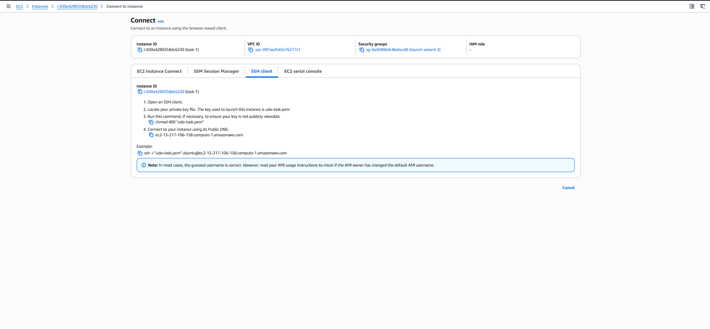

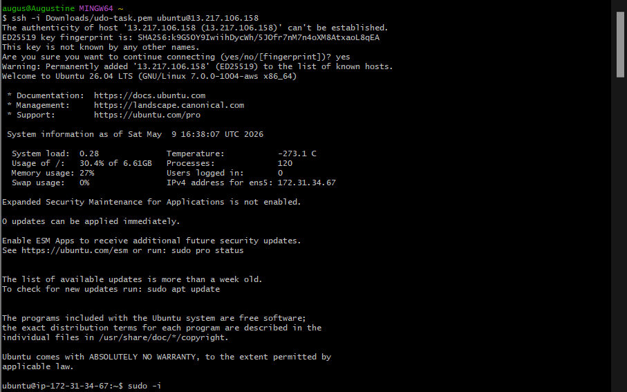

> **Note:** On every **start and stop** of the EC2 instance, the public IP address changes — so always use the updated IP when reconnecting.

---

## Step 1 — Installing Apache & Updating the Firewall

Installed Apache using Ubuntu's package manager `apt`:

```bash
# Update package list
sudo apt update

# Install Apache
sudo apt install apache2

# Verify Apache is running
sudo systemctl status apache2
```

**Result:** Apache is active and running ✅

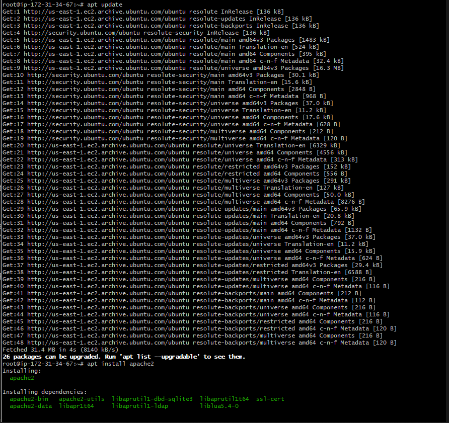

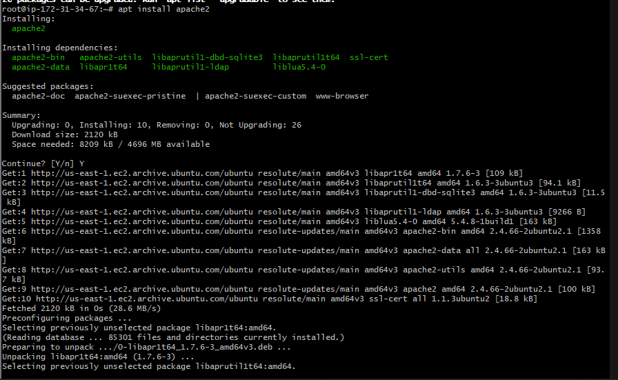

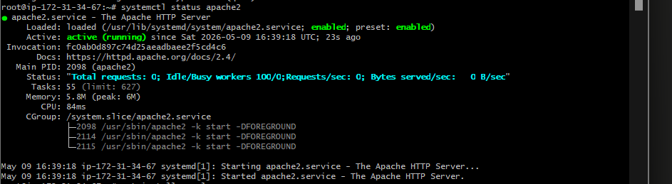

Before receiving any traffic, TCP port **80** was opened in the EC2 security group inbound rules to allow HTTP traffic from anywhere.

To verify Apache locally:
```bash
curl http://localhost:80
```

Accessing via public IP in the browser confirmed Apache was live — the **Ubuntu Apache2 Default Page** loaded successfully.

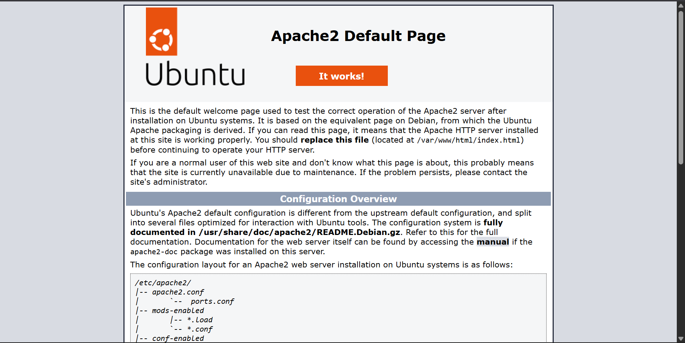

---

## Step 2 — Installing MySQL

Installed MySQL using `apt`:

```bash
sudo apt install mysql-server
```

When prompted, confirmed installation by typing `Y`.

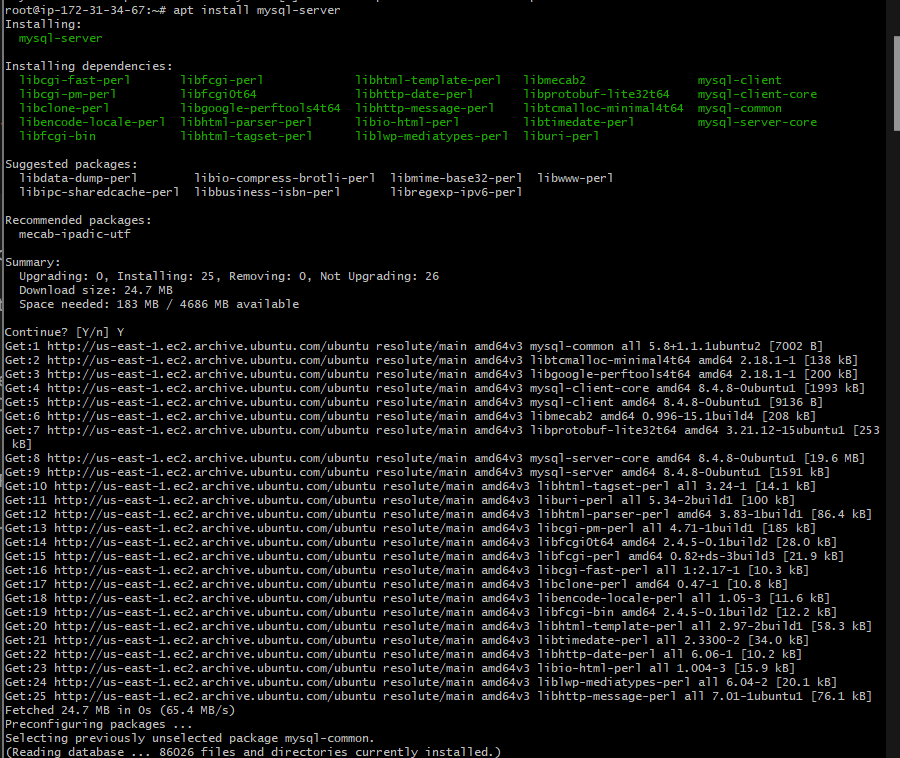

Logged into the MySQL console:

```bash
sudo mysql
```

**Server version confirmed:** MySQL 8.4.8-0ubuntu1 ✅

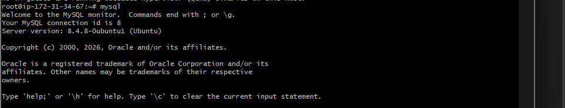

Edited MySQL config to enable `mysql_native_password` plugin:

```bash
vim /etc/mysql/mysql.conf.d/mysqld.cnf
```

Restarted MySQL, logged back in and set the root password:

```sql
ALTER USER 'root'@'localhost' IDENTIFIED WITH mysql_native_password BY 'PassWord.1';
FLUSH PRIVILEGES;
exit;
```

Ran the MySQL secure installation script:

```bash
mysql_secure_installation
```

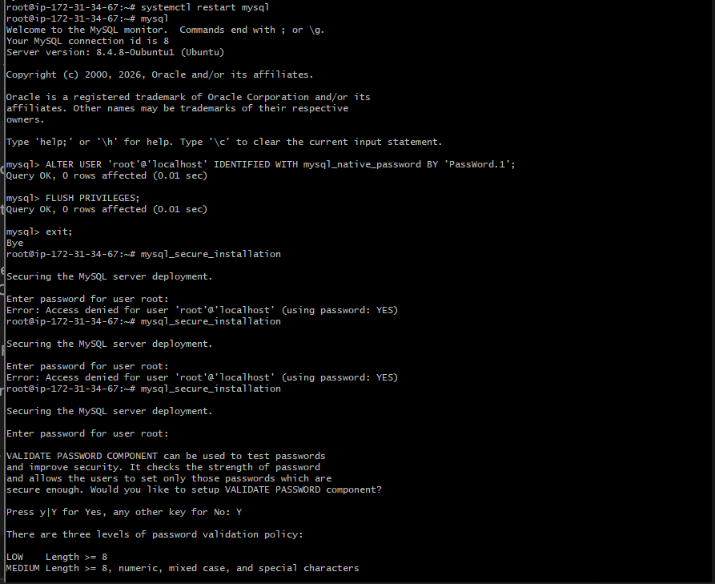

Verified login with the new password:

```bash
mysql -p
```

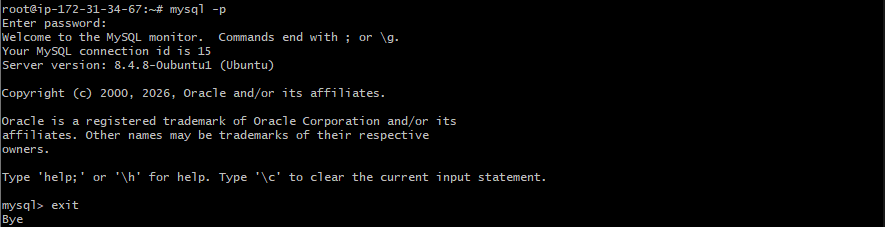

---

## Step 3 — Installing PHP

Installed PHP along with required modules for Apache and MySQL:

```bash
sudo apt install php libapache2-mod-php php-mysql
```

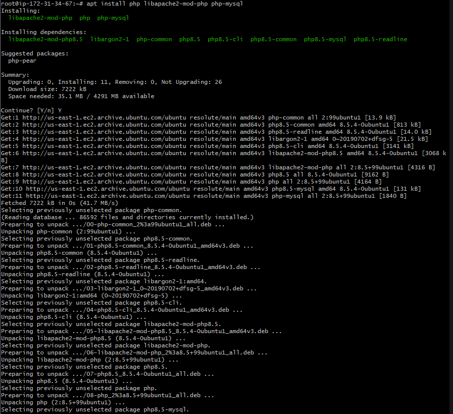

Verified PHP installation:

```bash
php -v
```
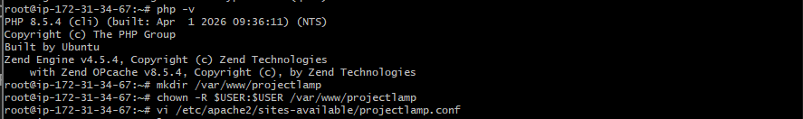

**Result:** PHP 8.5.4 installed successfully ✅

---

## Step 4 — Creating a Virtual Host for the Website Using Apache

Created a project directory and set correct ownership:

```bash
sudo mkdir /var/www/projectlamp
sudo chown -R $USER:$USER /var/www/projectlamp
```

Created a new Apache virtual host configuration file:

```bash
sudo vi /etc/apache2/sites-available/projectlamp.conf
```

Added the following configuration:

```apache
<VirtualHost *:80>
    ServerName projectlamp
    ServerAlias www.projectlamp
    ServerAdmin webmaster@localhost
    DocumentRoot /var/www/projectlamp
    ErrorLog ${APACHE_LOG_DIR}/error.log
    CustomLog ${APACHE_LOG_DIR}/access.log combined
</VirtualHost>
```

Enabled the new site and disabled the Apache default site:

```bash
sudo a2ensite projectlamp
sudo a2dissite 000-default
sudo apache2ctl configtest      # Syntax OK ✅
sudo systemctl reload apache2
```

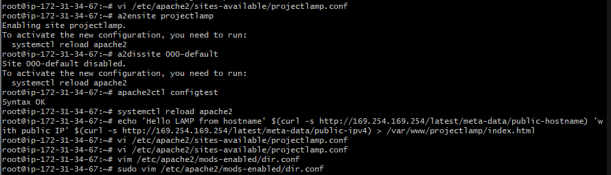

Created a test `index.html` to verify the virtual host was working:

```bash
echo 'Hello LAMP from hostname' $(curl -s http://169.254.169.254/latest/meta-data/public-hostname) \
'with public IP' $(curl -s http://169.254.169.254/latest/meta-data/public-ipv4) \
> /var/www/projectlamp/index.html
```

**Result in browser:** Virtual host confirmed working ✅

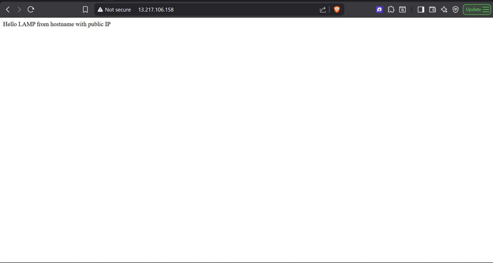

---

## Step 5 — Enabling PHP on the Website

By default, Apache serves `index.html` before `index.php`. To change this behavior, edited the `dir.conf` file:

```bash
sudo vim /etc/apache2/mods-enabled/dir.conf
```

Changed the `DirectoryIndex` directive from:
```apache
DirectoryIndex index.html index.cgi index.pl index.php index.xhtml index.htm
```

To:
```apache
DirectoryIndex index.php index.html index.cgi index.pl index.xhtml index.htm
```

Reloaded Apache to apply the change:

```bash
sudo systemctl reload apache2
```

Created a PHP test script to validate that PHP is correctly installed and configured:

```bash
vim /var/www/projectlamp/index.php
```

```php
<?php
phpinfo();
```

**Result in browser:** PHP 8.5.4 info page displayed successfully ✅


> ⚠️ After confirming PHP works, remove the `index.php` file as it contains sensitive server information:
> ```bash
> sudo rm /var/www/projectlamp/index.php
> ```

---

## ✅ Final Result — LAMP Stack Fully Operational

| Component | Technology | Version |
|-----------|-----------|---------|
| **L** — Linux | Ubuntu on AWS EC2 | 26.04 LTS |
| **A** — Apache | Apache HTTP Server | 2.4.66 |
| **M** — MySQL | MySQL Community Server | 8.4.8 |
| **P** — PHP | PHP | 8.5.4 |

**My LAMP stack is completely installed and fully operational on AWS EC2.** 🚀

---