# MY LEMP STACK IMPLEMENTATION ON AWS
### Linux | Nginx | MySQL | PHP

---

## 🏆 What I Gained From This Project

After completing this project, I:

- Strengthened my confidence working in the Linux terminal on AWS
- Deepened my understanding of the LEMP stack and how it differs from LAMP (Nginx vs Apache)
- Gained practical experience configuring Nginx server blocks, PHP-FPM, and MySQL
- Learned how to connect a PHP application to a MySQL database and serve it via Nginx
- Built and deployed a working TODO web application on AWS EC2

---

## 📋 Project Overview

This document details the provisioning of a **LEMP stack** (Linux, Nginx, MySQL, PHP) on an **AWS EC2** instance. Screenshots are presented in the exact order they were captured during deployment.

---

## Step 0 — Preparing Prerequisites

- Launched a new EC2 instance — **Ubuntu Server 22.04 LTS with SQL Server 2022 Standard, t3.micro, Free Tier eligible**
- Instance name: `task-2`

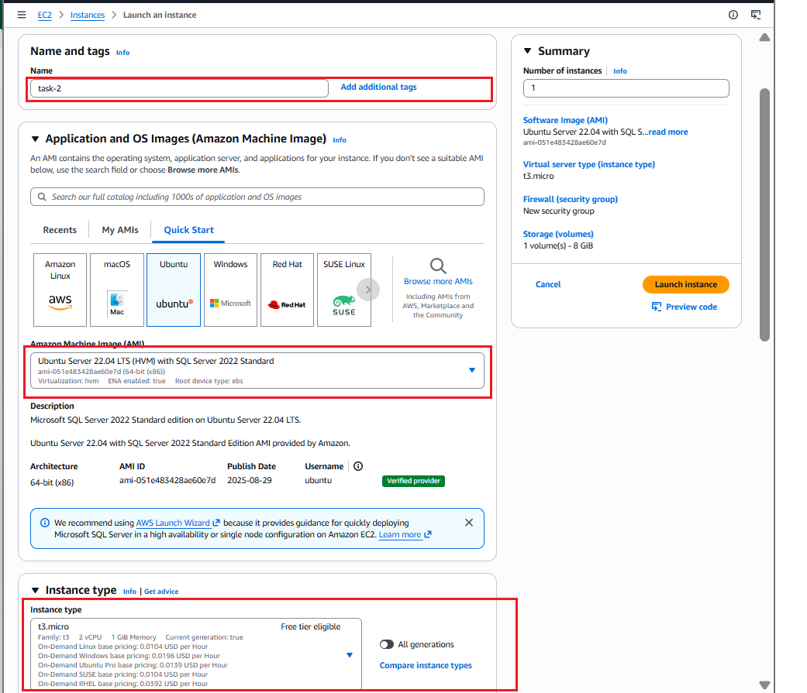

- Instance running successfully with Public IP `54.224.25.98` and Private IP `172.31.36.218`

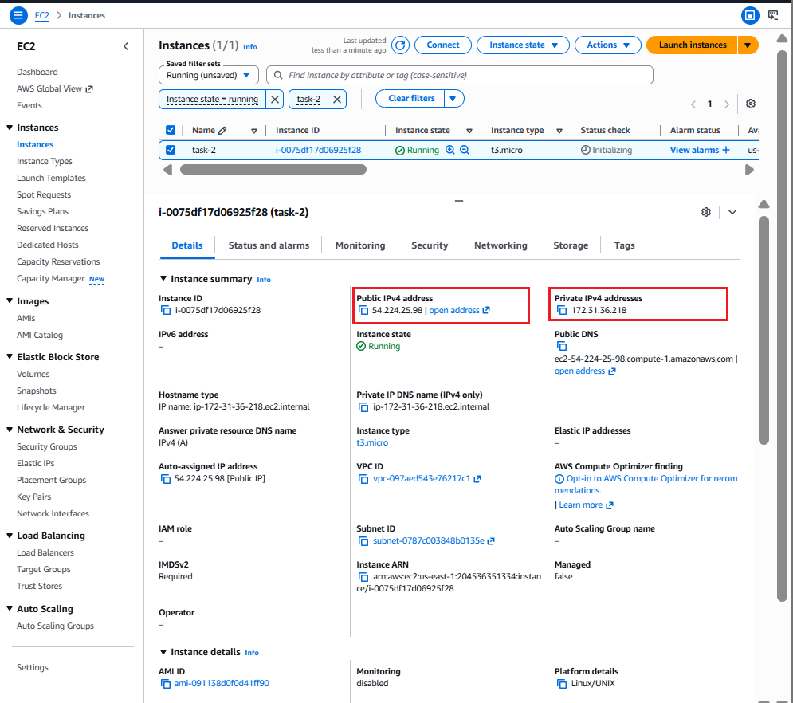

Connected via SSH client using `.pem` key:

```bash
ssh -i Downloads/udo-task.pem ubuntu@54.224.25.98
```

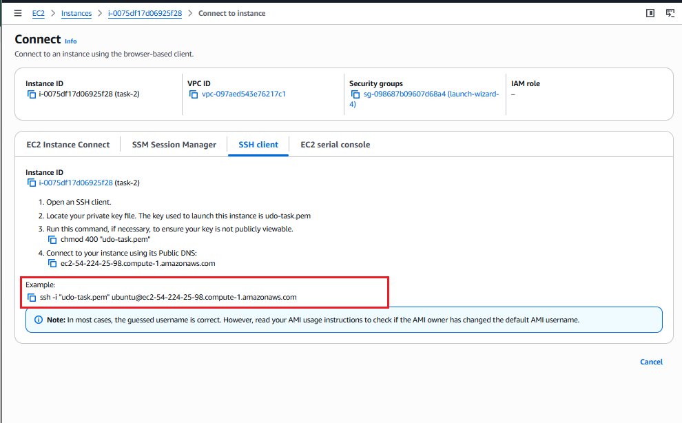

Successfully logged into the EC2 instance running Ubuntu 26.04 LTS:

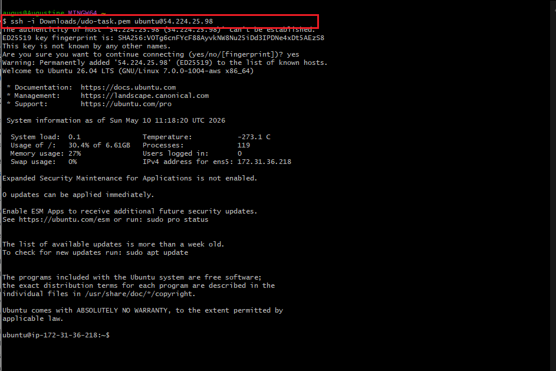

Switched to root user:

```bash
sudo -i
```

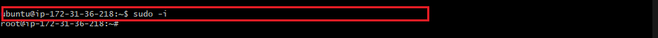

---

## Step 1 — Installing Nginx & Updating the Firewall

Updated package list and installed Nginx:

```bash
apt update
apt install nginx
```

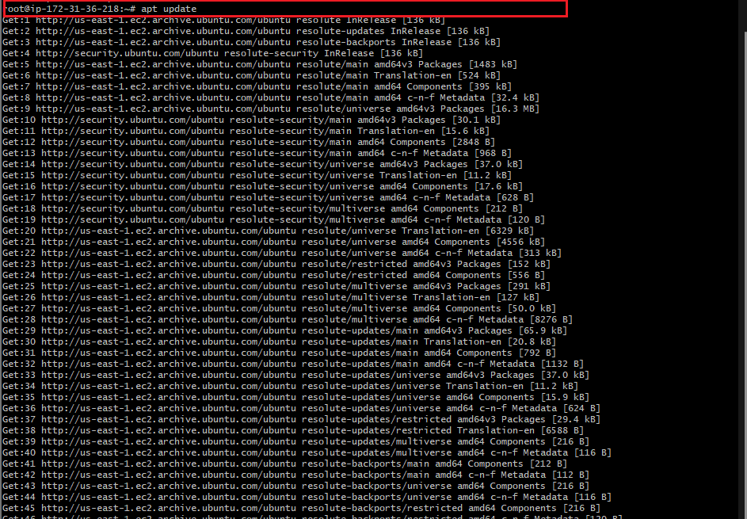

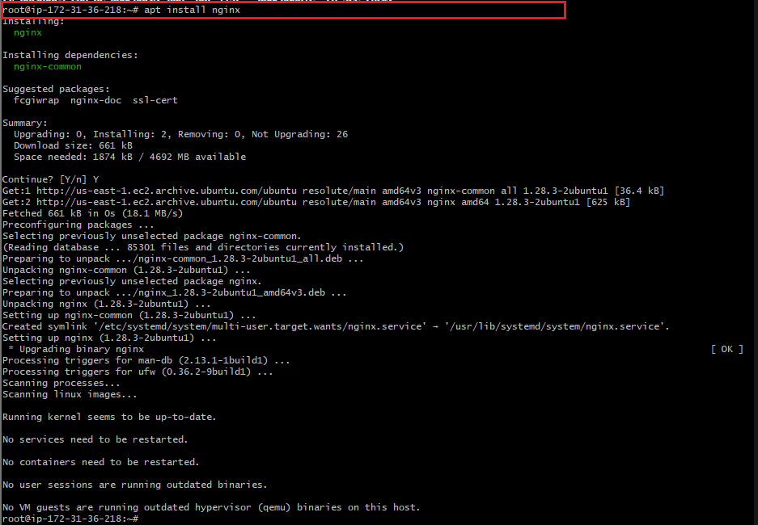

Verified Nginx was running:

```bash
systemctl status nginx
```

**Result:** Active (running)

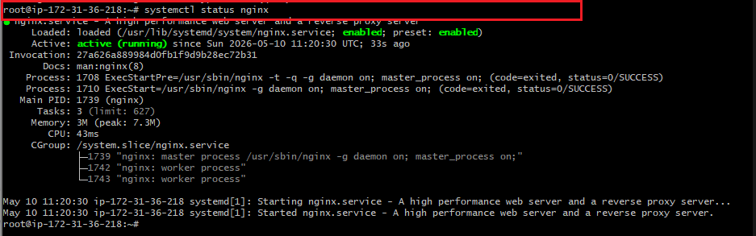

Verified Nginx locally and in browser:

```bash
curl http://localhost:80
```

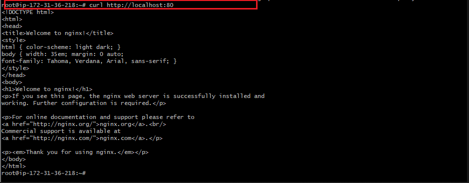

**Browser Result:** Welcome to nginx! page loaded successfully

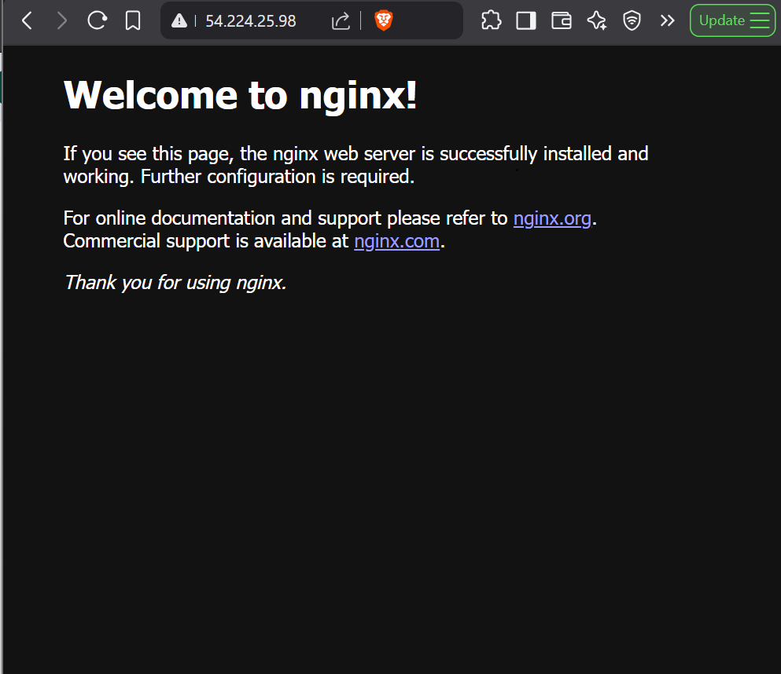

---

## Step 2 — Installing MySQL

Installed MySQL server:

```bash
apt install mysql-server
```

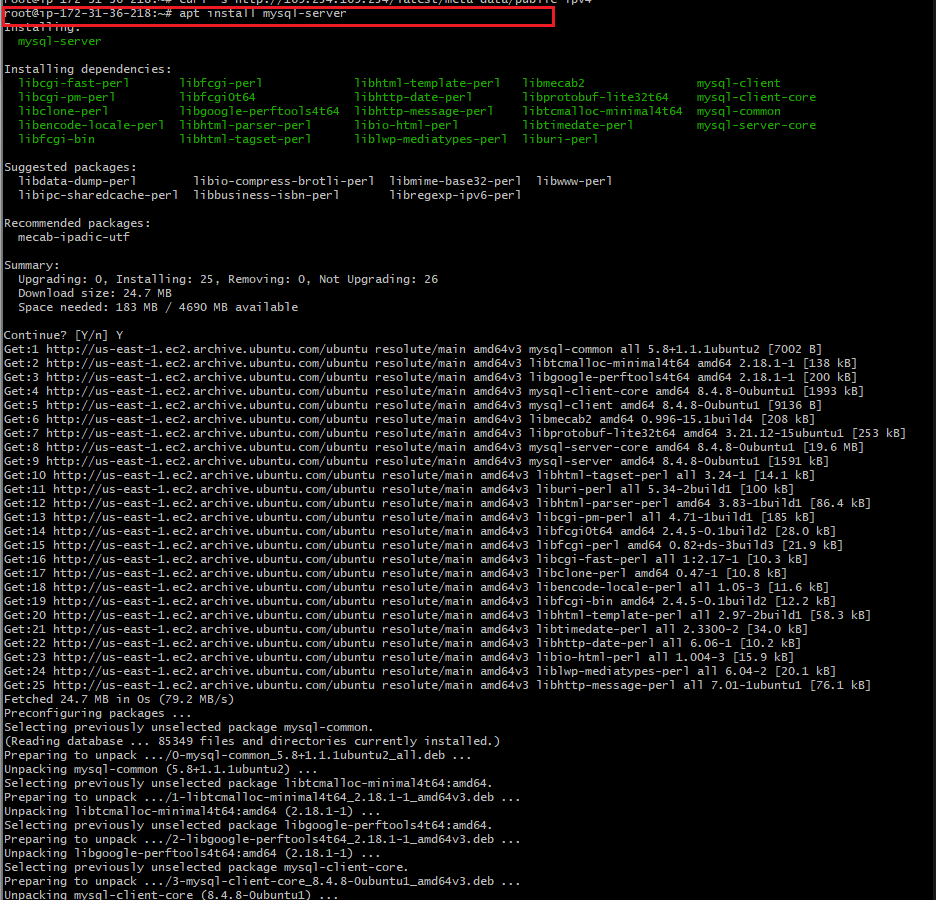

Logged into MySQL console:

```bash
mysql
```

**Server version confirmed:** MySQL 8.4.8-0ubuntu1

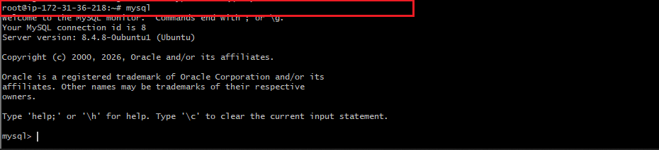

Edited MySQL config to enable `mysql_native_password` plugin:

```bash
sudo vim /etc/mysql/mysql.conf.d/mysqld.cnf
```

Added under `[mysqld]`:
```ini
mysql_native_password=ON
```

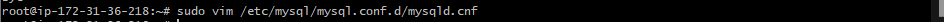

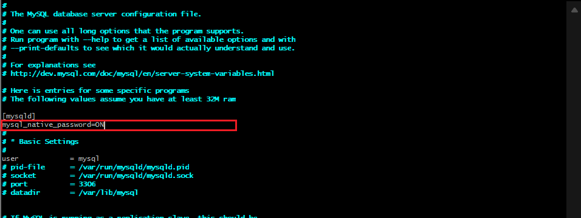

Attempted to set root password — got plugin error initially:

```sql
ALTER USER 'root'@'localhost' IDENTIFIED WITH mysql_native_password BY 'PassWord.1';
-- ERROR 1524: Plugin 'mysql_native_password' is not loaded
```

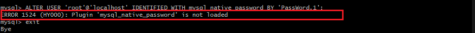

Restarted MySQL after enabling the plugin in config:

```bash
sudo systemctl restart mysql
```

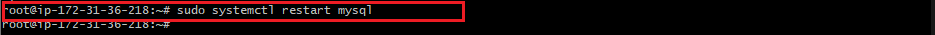

Ran the MySQL secure installation script:

```bash
mysql_secure_installation
```

Completed with:
- Validate password component enabled (MEDIUM policy)
- Anonymous users removed
- Root remote login disabled
- Test database removed
- Privilege tables reloaded

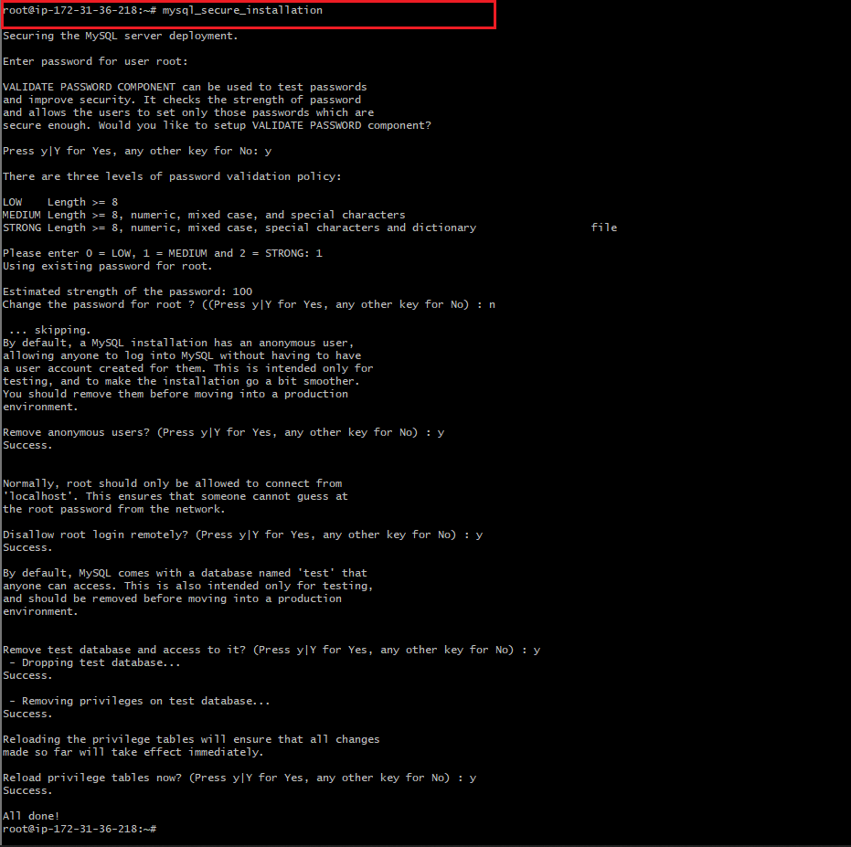

Verified login with password:

```bash
mysql -p
```

Successfully logged in

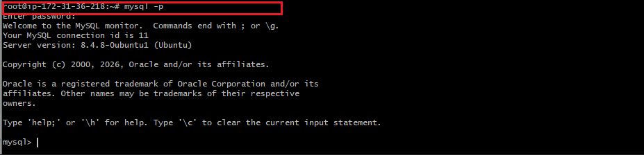

---

## Step 3 — Installing PHP

Installed PHP-FPM and PHP-MySQL:

```bash
apt install php-fpm php-mysql -y
```

This installed **PHP 8.5-fpm** — the correct version for this Ubuntu instance.

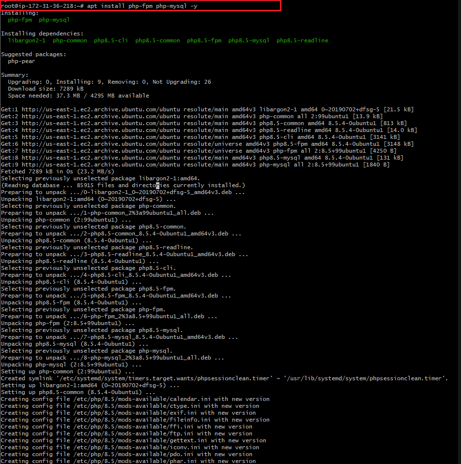

---

## Step 4 — Configuring Nginx to Use PHP Processor

Created the Nginx server block config for the project:

```bash
nano /etc/nginx/sites-available/projectLEMP
```

Initial config (before PHP socket fix):


Symlinked to sites-enabled to activate it:

```bash
ln -s /etc/nginx/sites-available/projectLEMP /etc/nginx/sites-enabled/
```

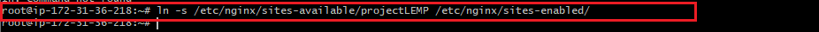

Tested config — found `i#` typo error, fixed it with vim, retested:

```bash
nginx -t
vim /etc/nginx/sites-available/projectLEMP
nginx -t
```

**Result:** Syntax OK

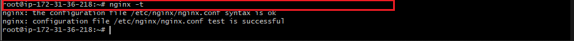

Unlinked the default Nginx site:

```bash
unlink /etc/nginx/sites-enabled/default
```

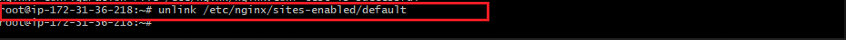

Created test `index.html` to verify virtual host:

```bash
sudo echo 'Hello LEMP from hostname' $(curl -s http://169.254.169.254/latest/meta-data/public-hostname) \
'with public IP' $(curl -s http://169.254.169.254/latest/meta-data/public-ipv4) \
> /var/www/projectLEMP/index.html
```

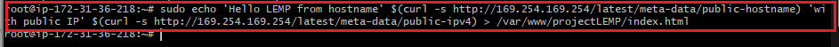

**Browser Result:** Virtual host working

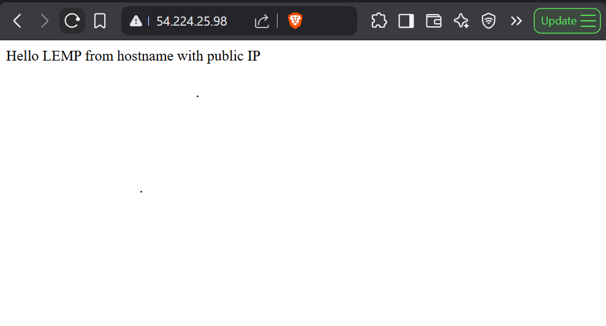

Updated Nginx config to use correct PHP 8.5 socket and set `index.php` first:

```nginx
server {
    listen 80;
    server_name projectLEMP www.projectLEMP;
    root /var/www/projectLEMP;

    index index.php index.html index.htm;

    location / {
        try_files $uri $uri/ =404;
    }

    location ~ \.php$ {
        include snippets/fastcgi-php.conf;
        fastcgi_pass unix:/var/run/php/php8.5-fpm.sock;
    }

    location ~ /\.ht {
        deny all;
    }
}
```

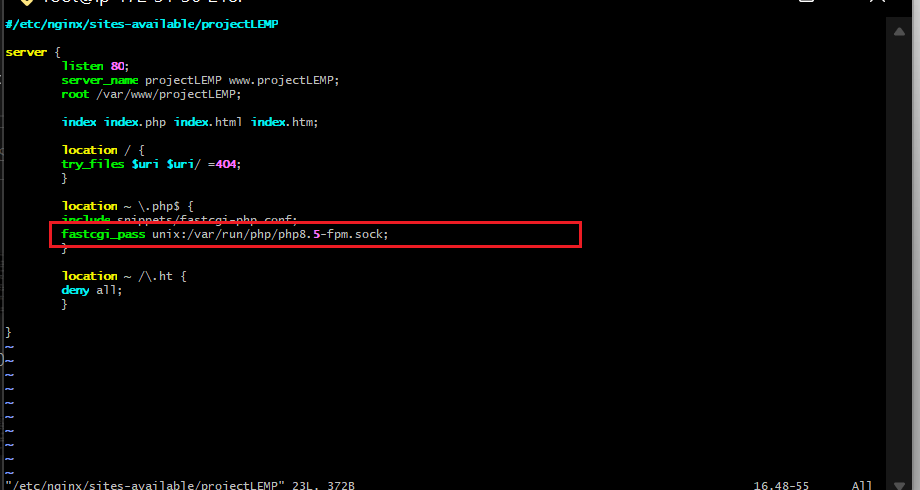

Removed the `index.html` so PHP takes priority:

```bash
rm -rf /var/www/projectLEMP/index.html
```

---

## Step 5 — Testing PHP with Nginx

Created a PHP info test file:

```bash
nano /var/www/projectLEMP/info.php
```

```php
<?php
phpinfo();
```

**Browser Result:** PHP 8.5.4 info page displayed via FPM/FastCGI

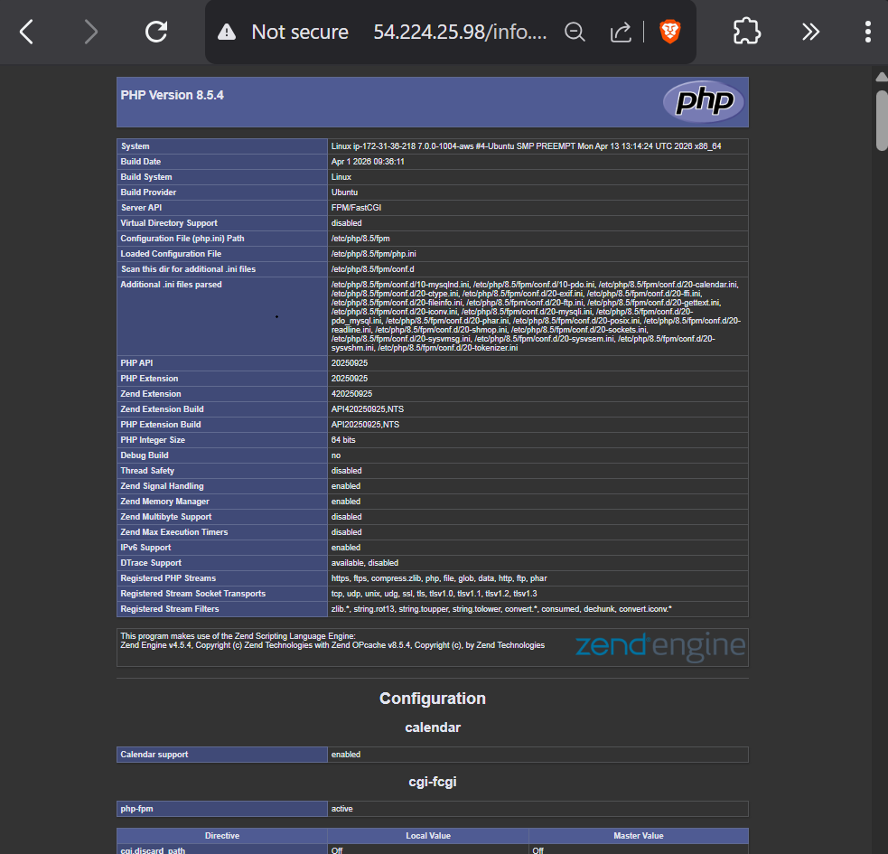

Removed the info.php file after verification:

```bash
rm /var/www/projectLEMP/info.php
```

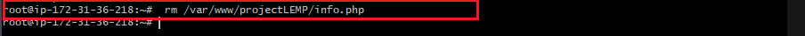

---

## Step 6 — Retrieving Data from MySQL Database with PHP

Logged into MySQL with root password:

```bash
mysql -u root -p
```

Created a new database and user:

```sql
CREATE DATABASE `example_database`;

CREATE USER 'example_user'@'%' IDENTIFIED WITH mysql_native_password BY 'August.1';

GRANT ALL ON example_database.* TO 'example_user'@'%';
```

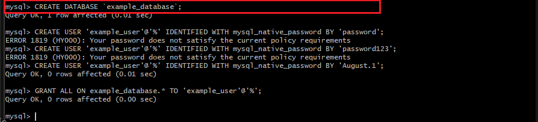

Verified `example_user` login:

```bash
mysql -u example_user -p
```

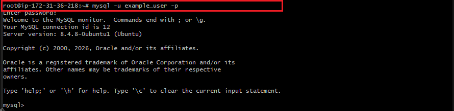

Confirmed database access:

```sql
SHOW DATABASES;
```

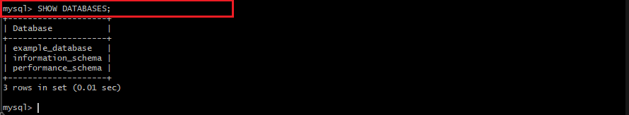

Created a `todo_list` table and inserted test data:

```sql
CREATE TABLE example_database.todo_list (
    item_id INT AUTO_INCREMENT,
    content VARCHAR(255),
    PRIMARY KEY(item_id)
);

INSERT INTO example_database.todo_list (content) VALUES ("My first important item");

SELECT * FROM example_database.todo_list;
```

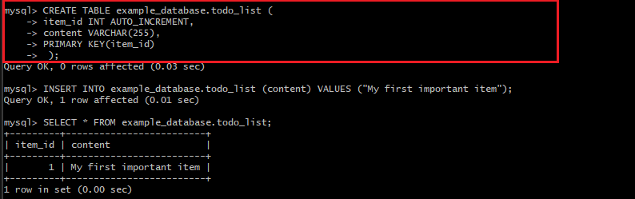

Added more items and verified all records:

```sql
INSERT INTO example_database.todo_list (content) VALUES ("My second important item");
INSERT INTO example_database.todo_list (content) VALUES ("My third important item");
INSERT INTO example_database.todo_list (content) VALUES ("and this is one more thing");

SELECT * FROM example_database.todo_list;
```

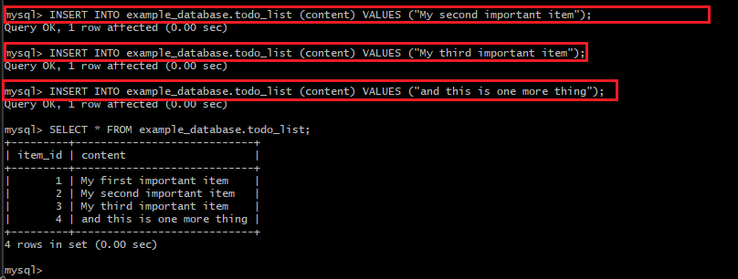

Created the PHP script to display the TODO list:

```bash
vim /var/www/projectLEMP/todo_list.php
```

```php
<?php
$user = "example_user";
$password = "August.1";
$database = "example_database";
$table = "todo_list";

try {
    $db = new PDO("mysql:host=localhost;dbname=$database", $user, $password);
    echo "<h2>TODO</h2><ol>";
    foreach($db->query("SELECT content FROM $table") as $row) {
        echo "<li>" . $row['content'] . "</li>";
    }
    echo "</ol>";
} catch (PDOException $e) {
    print "Error!: " . $e->getMessage() . "<br/>";
    die();
}
```

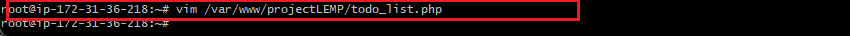

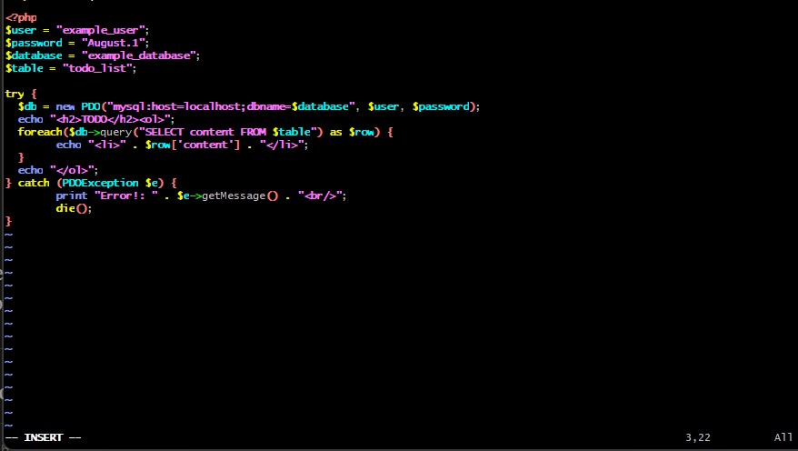

**Browser Result:** TODO list displayed successfully from MySQL database

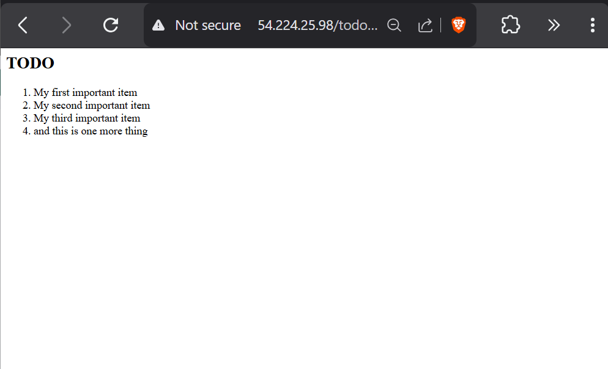

---

## Final Result — LEMP Stack Fully Operational

| Component | Technology | Version |
|-----------|-----------|---------|
| **L** — Linux | Ubuntu on AWS EC2 | 26.04 LTS |
| **E** — Nginx | Nginx Web Server | 1.28.3 |
| **M** — MySQL | MySQL Community Server | 8.4.8 |
| **P** — PHP | PHP-FPM | 8.5.4 |

**My LEMP stack is completely installed, fully operational, and serving a live PHP + MySQL application on AWS EC2.**