# MY MEAN STACK IMPLEMENTATION ON AWS
### MongoDB | Express | AngularJS | Node.js

---

## What I Gained From This Project

After completing this project, I:

- Strengthened my confidence deploying full-stack JavaScript applications on AWS EC2
- Deepened my understanding of the MEAN stack and how its components interact end-to-end
- Gained practical experience installing and configuring MongoDB 8.0 on Ubuntu 24.04
- Learned how to build a RESTful API with Express and connect it to a MongoDB database via Mongoose
- Understood how to modernise legacy callback-based Mongoose code to async/await
- Built and deployed a working Book Register web application on AWS EC2 accessible via public IP

---

## Project Overview

This document details the provisioning of a **MEAN stack** (MongoDB, Express, AngularJS, Node.js) on an **AWS EC2** instance. Screenshots are presented in the exact order they were captured during deployment.

---

## Step 0 — Preparing Prerequisites

- Launched a new EC2 instance — **Ubuntu Server 24.04 LTS (Noble), t3.micro, Free Tier eligible**
- Instance name: `Project-MEAN`

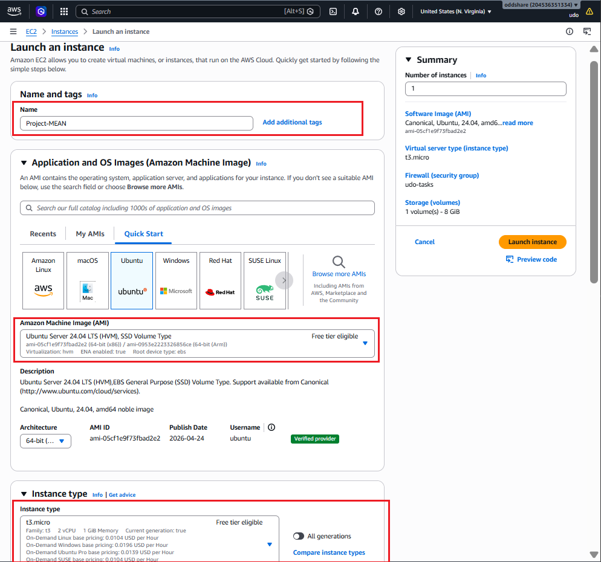

- Instance running successfully with Public IP `98.82.177.115` and Private IP `172.31.47.38`

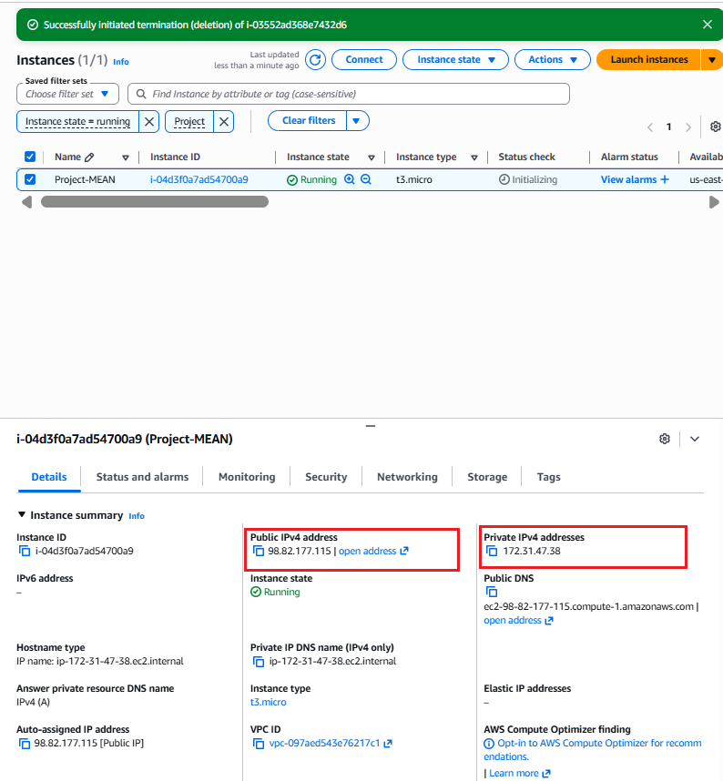

Connected via SSH client using `.pem` key:

```bash
ssh -i Downloads/udo-task.pem ubuntu@98.82.177.115
```

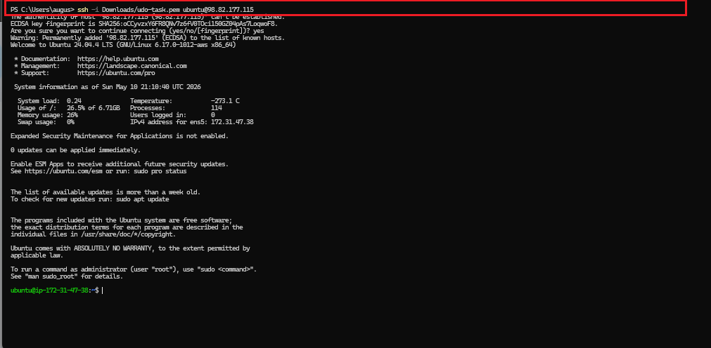

Switched to root user:

```bash
sudo -i
```

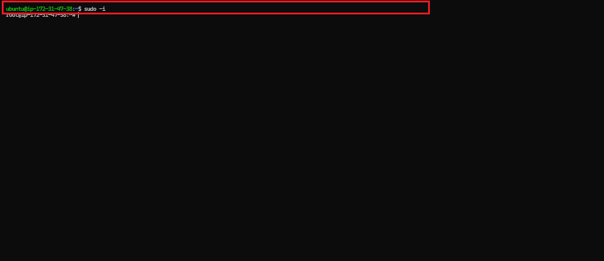

---

## Step 1 — Installing Node.js

Updated the package list and upgraded existing packages:

```bash
apt update
apt upgrade -y
```

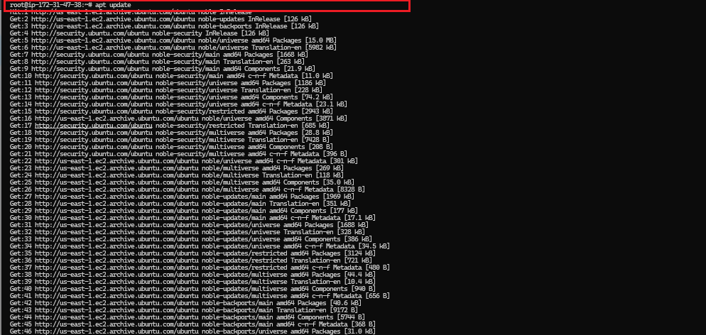

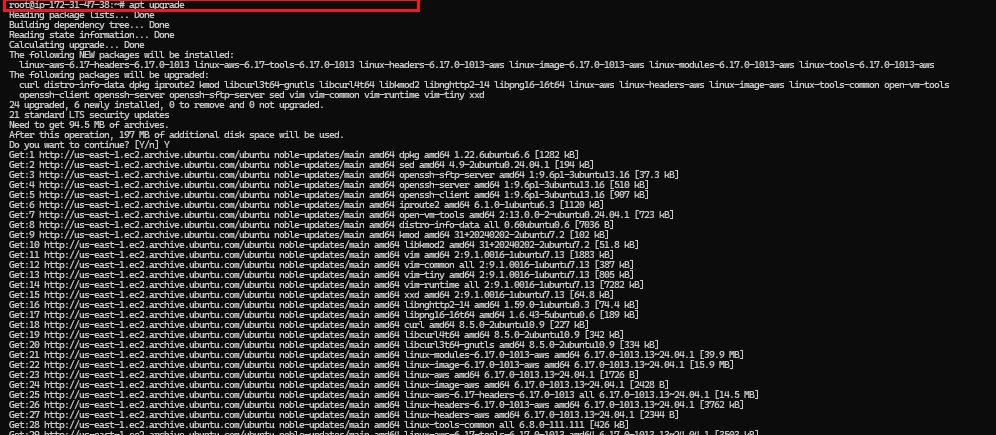

Installed prerequisite packages:

```bash
apt -y install curl dirmngr apt-transport-https lsb-release ca-certificates
```

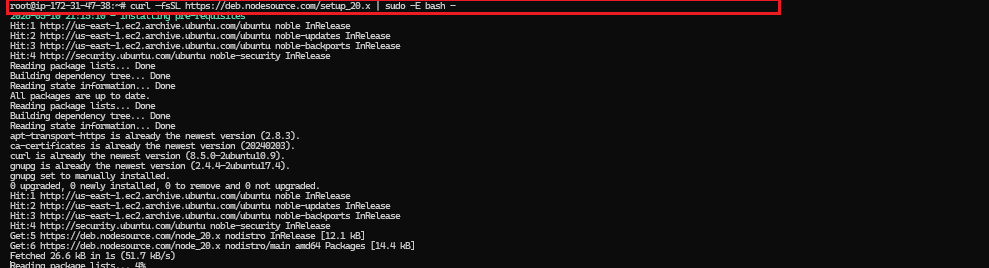

Added the NodeSource repository for Node.js 20.x and installed Node.js:

```bash
curl -fsSL https://deb.nodesource.com/setup_20.x | sudo -E bash -
apt install -y nodejs
```


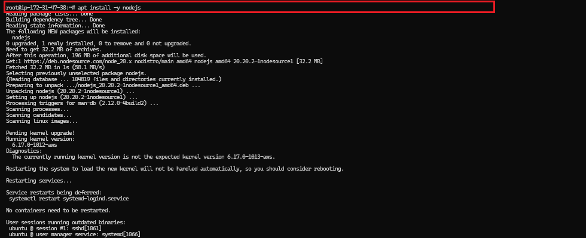

**Result:** Node.js v20.20.2 installed successfully

---

## Step 2 — Installing MongoDB

Added the MongoDB 8.0 GPG key and repository for Ubuntu Noble (24.04):

```bash
curl -fsSL https://www.mongodb.org/static/pgp/server-8.0.asc | \
  gpg --dearmor -o /usr/share/keyrings/mongodb-server-8.0.gpg

echo "deb [ arch=amd64,arm64 signed-by=/usr/share/keyrings/mongodb-server-8.0.gpg ] \
  https://repo.mongodb.org/apt/ubuntu noble/mongodb-org/8.0 multiverse" | \
  tee /etc/apt/sources.list.d/mongodb-org-8.0.list
```

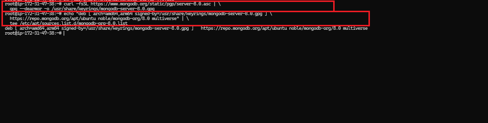

Updated package list and installed MongoDB:

```bash
apt update
apt install -y mongodb-org
```

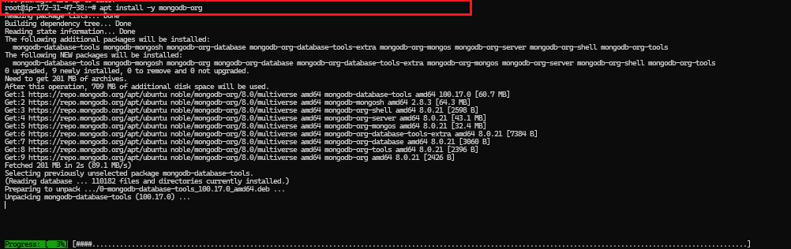

Started, enabled, and verified MongoDB:

```bash
systemctl start mongod
systemctl enable mongod
systemctl status mongod
```

**Result:** Active (running)

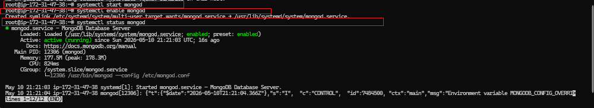

---

## Step 3 — Setting Up the Application

Installed `body-parser` globally to handle JSON request bodies:

```bash
npm install body-parser
```

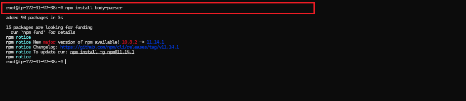

Created the project directory and initialised a new Node.js application:

```bash
mkdir Books && cd Books
npm init
```

Filled in the prompts:
- Package name: `books`
- Description: `A Book Register`
- Entry point: `index.js`
- Author: `udo`

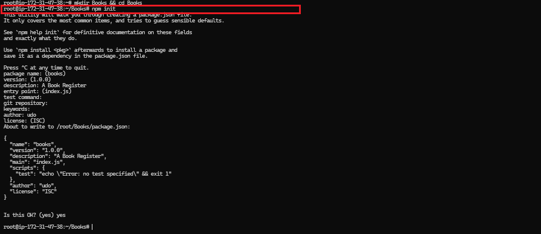

---

## Step 4 — Creating the Server

Created `server.js` in the `Books` directory:

```bash
vi server.js
```

```javascript
var express = require('express');
var bodyParser = require('body-parser');
var app = express();
app.use(express.static(__dirname + '/public'));
app.use(bodyParser.json());
require('./apps/routes')(app);
app.set('port', 3300);
app.listen(app.get('port'), function() {
    console.log('Server up: http://localhost:' + app.get('port'));
});
```

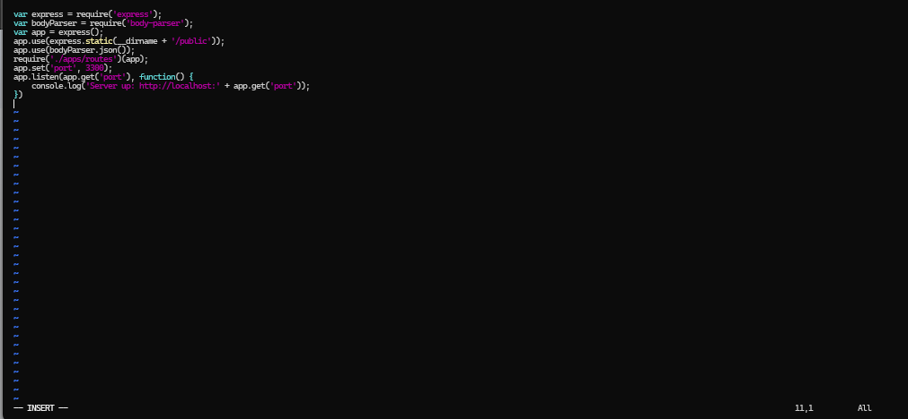

Installed Express and Mongoose as project dependencies:

```bash
npm install express mongoose
```

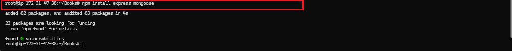

---

## Step 5 — Creating the Routes and Model

Created the `apps` directory and the routes file:

```bash
mkdir apps && cd apps
vi routes.js
```

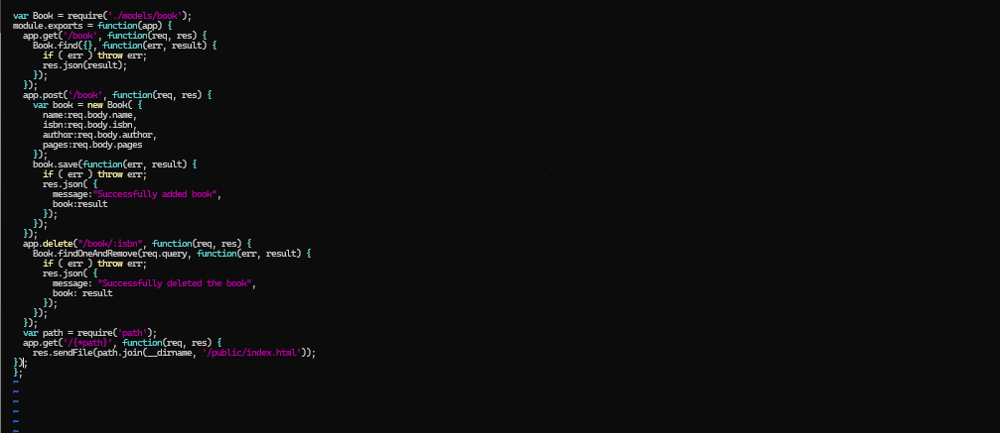

Since the installed Mongoose version no longer accepts callbacks, all routes were written using `async/await`. `findOneAndRemove` was also replaced with the current `findOneAndDelete`:

```javascript
var Book = require('./models/book');
var path = require('path');

module.exports = function(app) {
  app.get('/book', async function(req, res) {
    try {
      var result = await Book.find({});
      res.json(result);
    } catch(err) {
      res.status(500).json({ message: err.message });
    }
  });

  app.post('/book', async function(req, res) {
    try {
      var book = new Book({
        name: req.body.name,
        isbn: req.body.isbn,
        author: req.body.author,
        pages: req.body.pages
      });
      var result = await book.save();
      res.json({
        message: "Successfully added book",
        book: result
      });
    } catch(err) {
      res.status(500).json({ message: err.message });
    }
  });

  app.delete("/book/:isbn", async function(req, res) {
    try {
      var result = await Book.findOneAndDelete(req.query);
      res.json({
        message: "Successfully deleted the book",
        book: result
      });
    } catch(err) {
      res.status(500).json({ message: err.message });
    }
  });

  app.get('/{*path}', function(req, res) {
    res.sendFile(path.join(__dirname, '../public/index.html'));
  });
};
```

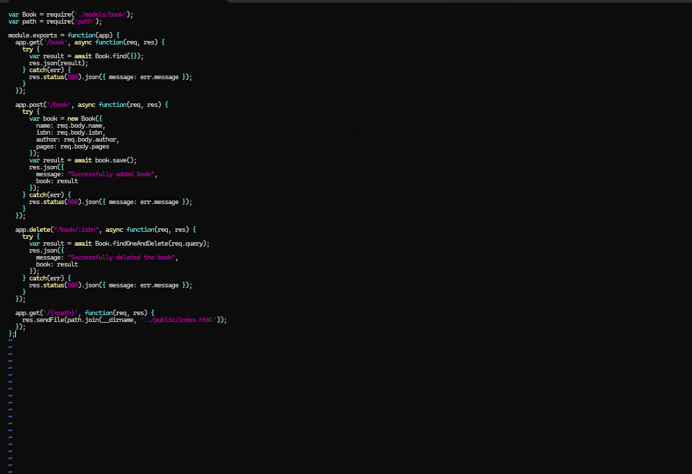

Created the `models` directory and the Mongoose Book model:

```bash
mkdir models && cd models
vi book.js
```


```javascript
var mongoose = require('mongoose');
var dbHost = 'mongodb://localhost:27017/test';
mongoose.connect(dbHost);
mongoose.connection;
mongoose.set('debug', true);
var bookSchema = mongoose.Schema({
  name: String,
  isbn: {type: String, index: true},
  author: String,
  pages: Number
});
var Book = mongoose.model('Book', bookSchema);
module.exports = mongoose.model('Book', bookSchema);
```

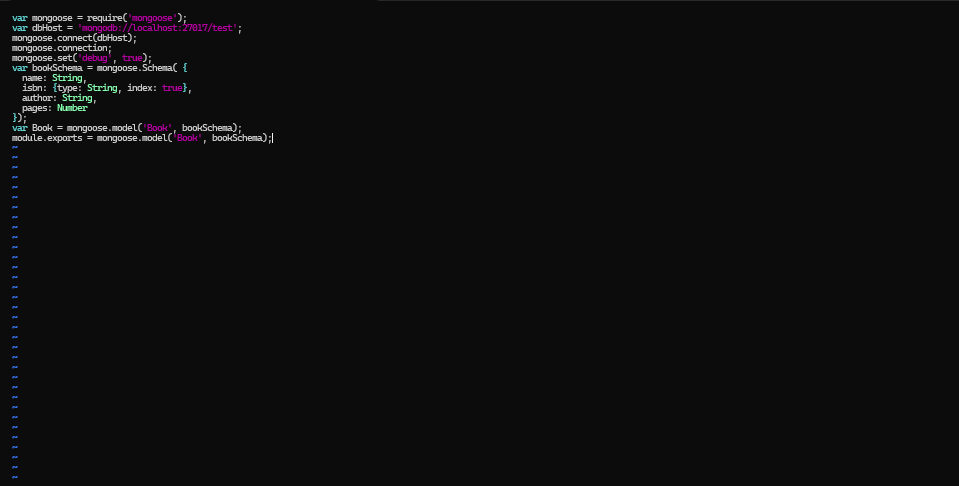

---

## Step 6 — Creating the Frontend

Navigated back to the `Books` root and created the `public` directory:

```bash
cd ~/Books
mkdir public && cd public
vi script.js
```


Added the AngularJS controller to handle GET, POST, and DELETE operations against the API:

```javascript
var app = angular.module('myApp', []);
app.controller('myCtrl', function($scope, $http) {
  $http({
    method: 'GET',
    url: '/book'
  }).then(function successCallback(response) {
    $scope.books = response.data;
  }, function errorCallback(response) {
    console.log('Error: ' + response);
  });

  $scope.del_book = function(book) {
    $http({
      method: 'DELETE',
      url: '/book/:isbn',
      params: { isbn: book.isbn }
    }).then(function successCallback(response) {
      console.log(response);
    }, function errorCallback(response) {
      console.log('Error: ' + response);
    });
  };

  $scope.add_book = function() {
    var body = '{ "name": "' + $scope.Name +
      '", "isbn": "' + $scope.Isbn +
      '", "author": "' + $scope.Author +
      '", "pages": "' + $scope.Pages + '" }';
    $http({
      method: 'POST',
      url: '/book',
      data: body
    }).then(function successCallback(response) {
      console.log(response);
    }, function errorCallback(response) {
      console.log('Error: ' + response);
    });
  };
});
```

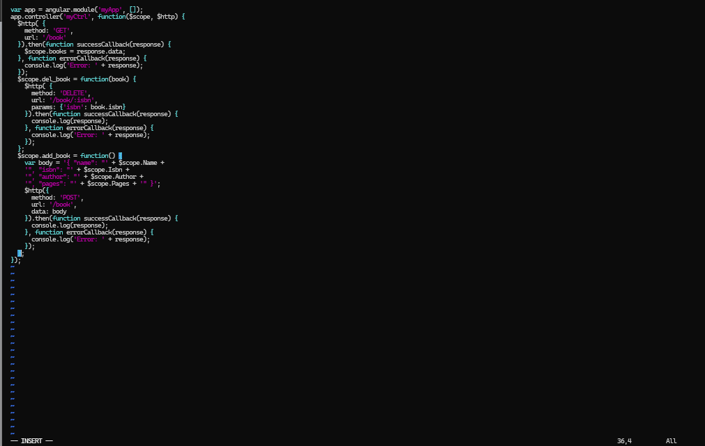

Created `index.html` as the frontend view:

```bash
vi index.html
```

```html
<!doctype html>
<html ng-app="myApp" ng-controller="myCtrl">
  <head>
    <script src="https://ajax.googleapis.com/ajax/libs/angularjs/1.6.4/angular.min.js"></script>
    <script src="script.js"></script>
  </head>
  <body>
    <div>
      <table>
        <tr><td>Name:</td><td><input type="text" ng-model="Name"></td></tr>
        <tr><td>Isbn:</td><td><input type="text" ng-model="Isbn"></td></tr>
        <tr><td>Author:</td><td><input type="text" ng-model="Author"></td></tr>
        <tr><td>Pages:</td><td><input type="number" ng-model="Pages"></td></tr>
      </table>
      <button ng-click="add_book()">Add</button>
    </div>
    <hr>
    <div>
      <table>
        <tr>
          <th>Name</th><th>Isbn</th><th>Author</th><th>Pages</th>
        </tr>
        <tr ng-repeat="book in books">
          <td>{{book.name}}</td>
          <td>{{book.isbn}}</td>
          <td>{{book.author}}</td>
          <td>{{book.pages}}</td>
          <td><input type="button" value="Delete" data-ng-click="del_book(book)"></td>
        </tr>
      </table>
    </div>
  </body>
</html>
```

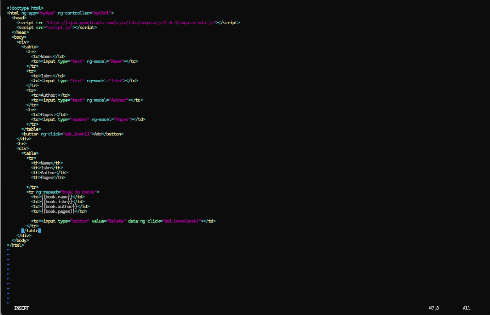

---

## Step 7 — Starting the Server and Testing

Started the Node.js server:

```bash
cd ~/Books
node server.js
```

**Result:** `Server up: http://localhost:3300`
Mongoose confirmed MongoDB connection by logging the index creation.

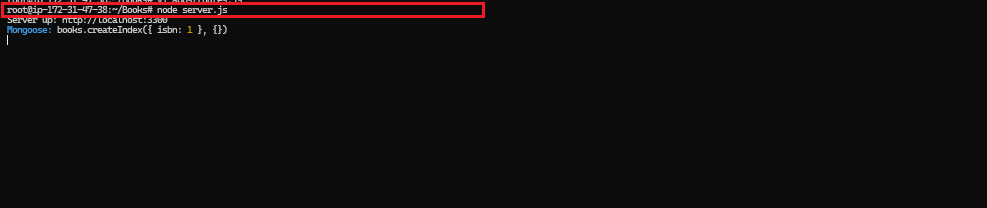

Verified the application locally using curl:

```bash
curl -s http://localhost:3300
```

**Result:** HTML content of the Book Register app returned successfully

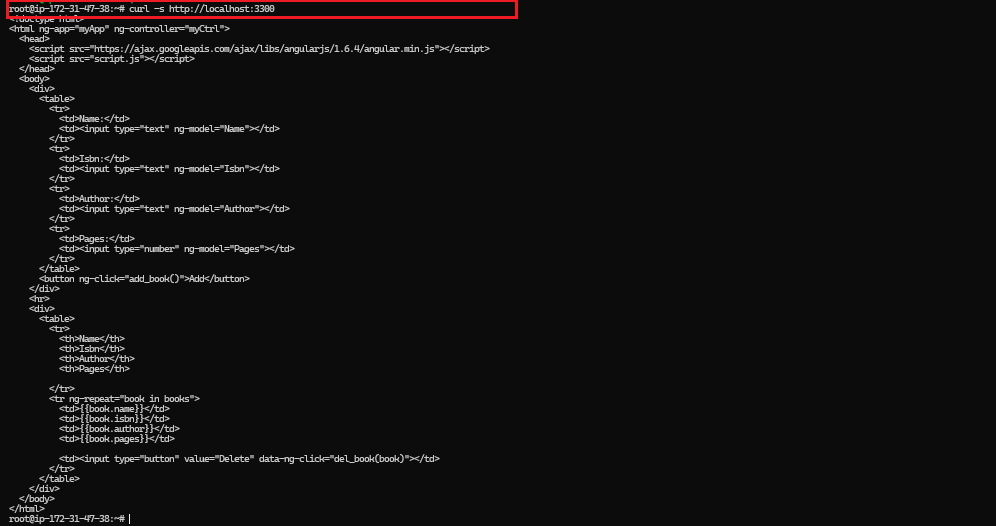

Opened a browser and navigated to the public IP on port 3300:

```
http://98.82.177.115:3300
```

**Browser Result:** Book Register form loaded with empty table

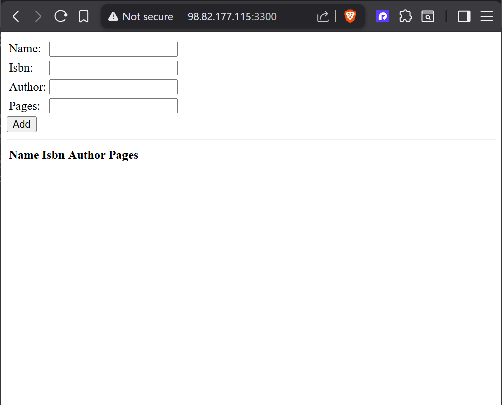

Added three books via the form:
- **Life** — ISBN: 123456754 — Author: E don B — Pages: 206
- **Dreams** — ISBN: 234674856 — Author: Unago C shege — Pages: 344
- **Ambition** — ISBN: 82312474356 — Author: udo — Pages: 44

**Browser Result:** All three books displayed in the table with Delete buttons

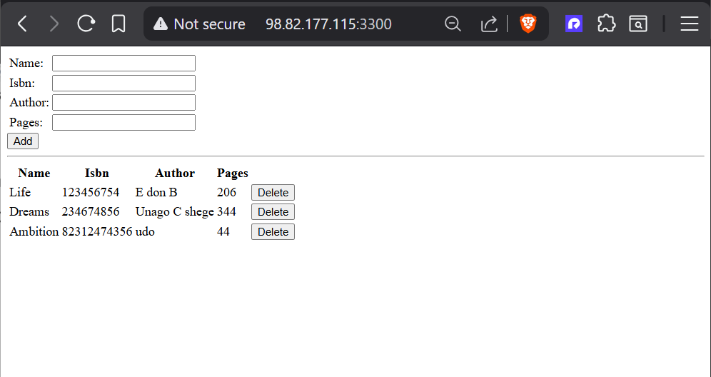

---

## Final Result — MEAN Stack Fully Operational

| Component | Technology | Version |
|-----------|------------|---------|
| **M** — MongoDB | MongoDB Community Server | 8.0.21 |
| **E** — Express | Express.js | 4.x |
| **A** — AngularJS | AngularJS Frontend Framework | 1.6.4 |
| **N** — Node.js | Node.js Runtime | 20.20.2 |

**My MEAN stack is completely installed, fully operational, and serving a live Book Register application on AWS EC2.**

| Image File | Description |
|------------|-------------|
| `step0-launch.png` | EC2 Launch Instance page |
| `step0-running.png` | EC2 Instance running in console |
| `step0-ssh-login.png` | Terminal SSH login |
| `step0-sudo.png` | sudo -i root switch |
| `step1-apt-update.png` | apt update output |
| `step1-apt-upgrade.png` | apt upgrade output |
| `step1-prerequisites.png` | curl dirmngr etc install |
| `step1-nodesource.png` | NodeSource setup_20.x script |
| `step1-nodejs-install.png` | apt install nodejs |
| `step2-mongo-repo.png` | MongoDB GPG key and repo setup |
| `step2-mongo-install.png` | apt install mongodb-org |
| `step2-mongo-status.png` | systemctl status mongod |
| `step3-body-parser.png` | npm install body-parser |
| `step3-npm-init.png` | npm init in Books directory |
| `step4-server-js.png` | server.js in vim |
| `step4-npm-install.png` | npm install express mongoose |
| `step5-mkdir-apps.png` | mkdir apps and vi routes.js |
| `step5-routes-js.png` | Final async/await routes.js |
| `step5-mkdir-models.png` | mkdir models and vi book.js |
| `step5-book-js.png` | Mongoose book model in vim |
| `step6-mkdir-public.png` | mkdir public and vi script.js |
| `step6-script-js.png` | AngularJS script.js in vim |
| `step6-index-html.png` | index.html in vim |
| `step7-server-running.png` | node server.js output |
| `step7-curl.png` | curl localhost:3300 output |
| `step7-browser-empty.png` | Browser - empty Book Register |
| `step7-browser-books.png` | Browser - 3 books added |